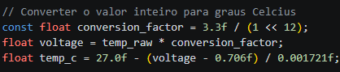

# Miaunitor – Monitoramento térmico para ambientes de filhotes

Esse programa foi desenvolvido para integrar um sistema embarcado. O projeto visa auxiliar nos cuidados de tutores a gatos filhotes órfãos ou em situação de abandono.

## Funcionalidades:

### • Leitura da temperatura do ambiente em tempo real
### • Alarme sonoro em casos de temperatura fora dos padrões
### • Sinalização visual, com cores de LED, indicando o problema
### • Controle de volume de alarme, com botões, e indicação visual do nível de volume, com matriz de LEDs.
### • Monitoramento remoto por meio de servidor
### • Interface Web HTML integrada ao servidor HTTP dentro do microcontrolador, para monitoramento remoto.

*O projeto foi desenvolvido à ausência de sensor de temperatura externa. O programa utiliza o sensor de temperatura interno do microcontrolador e o joystick da placa para simular a temperatura e sua variação.

## Hardware:

– Placa BitDogLab (Microcontrolador: Raspberry Pi Pico W “RP2040”)

### Periféricos utilizados:

### • ADC

O RP2040 possui um ADC de 12 bits, o que permite uma resolução de 4096 níveis (0 a 4095). Ele quantiza a tensão analógica (0V a 3.3V) em valores digitais.

Utilizamos dois canais simultâneos. Um canal realiza a leitura do sensor térmico interno, enquanto o outro monitora a posição do Joystick. O firmware converte esses níveis digitais em grandezas físicas (Volts e Celsius) através de equações lineares.

### • PWM

Técnica para controlar a quantidade de energia entregue a um componente eletrônico através de um sinal digital. gerida pela relação entre dois parâmetros fundamentais: o Wrap e o Duty Cycle.

Wrap define o limite superior da contagem do hardware de PWM. Ele determina o período total de uma oscilação completa (um ciclo).

Duty Cycle (Ciclo de Trabalho) é a proporção de tempo, dentro de um ciclo definido pelo Wrap, em que o sinal permanece em nível lógico alto.

### • Interrupção

O RP2040 possui um controlador de interrupções físico que monitora os pinos GP05 e GP06 de forma independente do processador principal.

Nesse projeto ele está sendo usado nos Botões. No momento em que o botão é pressionado, o hardware envia um sinal elétrico imediato que "avisa" a CPU. Isso garante que, mesmo que o microcontrolador esteja ocupado com outros processos, a reação ao clique nos botões seja imediata e prioritária.

### • Sensor de Temperatura Interno - Canal 4 do ADC

Utilizado para ler a temperatura do microcontrolador, e fazer a simulação da temperatura do ambiente.

Foi necessário, via código, fazer a conversão do valor entregue pelo ADC em graus Celsius.

### • Joystick Analógico (Eixo Y) - Pino GP26/Canal 0 do ADC

Utilizado para incrementar ou decrementar no valor final da temperatura. O valor inteiro entregue pelo ADC foi convertido em um intervalo de valores suficiente para o teste de mudança de temperatura.

### • Botão A - Pino GP05

Botão de valor lógico, usado para diminuir o volume do alarme, com interrupção.

### • Botão B - Pino GP06

Botão de valor lógico, usado para aumentar o volume do alarme, com interrupção.

### • LED RGB Central - GP13 (Vermelho)/GP12 (Azul)

LED usado para sinalizar se a temperatura está acima(vermelho ou abaixo(azul) do intervalo definido como seguro, enquanto o alarme está ativo.

### • Buzzer A - Pino GP21/PWM (Slice 2, Canal B)

Ativado durante o alarme, como um bipe contínuo.

### • Buzzer B - Pino GP10/PWM (Slice 5, Canal A)

Ativado durante o alarme, como um bipe intermitente.

### • Matriz de LEDs 5x5 (WS2812B) - Pino GP07

Foi utilizado para indicação visual do nível de volume dos buzzers durante o alarme.

Diferente de LEDs comuns, esses LEDs exigem pulsos de nanossegundos para definir as cores (formato GRB). Como o processador não consegue garantir esse tempo enquanto roda o Wi-Fi, você delegou essa tarefa ao PIO (Programmable I/O), que é um hardware independente do núcleo principal.

O sistema não envia um LED por vez; ele monta um vetor de 32 bits para cada um dos 25 LEDs no formato de cor verde-vermelho-azul (GRB) e "empurra" tudo de uma vez para a fila FIFO do PIO.

A fiação física não é linear; ela faz curvas para economizar trilhas. Foi realizado a conversão de coordenadas cartesianas (X, Y) para o índice real do LED.

### • Módulo Wi-Fi (CYW43439)

Integrado ao RP2040 via interface interna.

Usado para provimento do Servidor HTTP na porta 80.

### • Interface UART (via USB)

Utiliza os canais de dados do cabo USB para transmissão de telemetria a 115200 bps.

---

## Ambientação de Desenvolvimento:

As seguintes tecnológicas foram utilizadas para o desenvolvimento do programa:

* Linguagem: C
* SDK: Raspberry Pi Pico SDK 1.5.1
* Compilador:** CMake e ferramenta de build Ninja
* IDE: Visual Studio Code; Extensões: C/C++, CMake, CMake Tools, Raspiberry Pi Pico.
* Instalador de driver para USB: Zadig

### Bibliotecas:

**Estrutura e Utilidades:**
pico/stdlib.h, globals.h

**Hardware e Controle:**
hardware/adc.h, hardware/pwm.h, hardware/gpio.h, ws2812.pio.h

**Conectividade (Wi-Fi e Rede):**
pico/cyw43_arch.h, lwip/ip4_addr.h, lwip/netif.h

O programa utiliza o CMake como sistema de automação de compilação. O arquivo CMakeLists.txt na raiz do projeto realiza tarefas necessárias como o vínculo de bibliotecas, configuração do PIO, ativa a saída via USB (UART), e configura o projeto para gerar o arquivo executável no formato .uf2, compatível com o carregamento via USB no RP2040.

---

## Arquitetura do Firmware (miaunitor.c):

A lógica do foi projetada para ser não-bloqueante, permitindo que o monitoramento térmico, a interface de usuário e o servidor web funcionem de forma harmônica.

## Bibliotecas:

* stdio.h: Biblioteca padrão da linguagem C para entrada e saída, utilizada aqui para formatar as mensagens de log enviadas via terminal serial.
* pico/stdlib.h: Conjunto padrão de funções do SDK que engloba o controle básico de GPIO, UART para telemetria e gerenciamento de tempo.
* pico/util/datetime.h: Fornece utilitários para manipulação de estruturas de data e hora, útil para carimbos de tempo em logs de eventos futuros.
* hardware/adc.h: Controla o Conversor Analógico-Digital. No projeto, gerencia o Canal 4 (sensor de temperatura interno) e o Canal 0 (eixo Y do joystick).
* hardware/pwm.h: Utilizada para gerar os sinais de Modulação por Largura de Pulso para os Buzzers A e B, permitindo o controle de frequência e volume do alarme.
* hardware/gpio.h: Permite a manipulação dos pinos de propósito geral e a configuração de interrupções (IRQ) para os botões A e B.
* ws2812.pio.h: Arquivo de cabeçalho gerado pelo compilador PIO que contém as instruções de baixo nível para controlar o tempo crítico da matriz de LEDs RGB.
* pico/cyw43_arch.h: Biblioteca principal para interface com o chip de rádio CYW43439 da Infineon, responsável pelo Wi-Fi e Bluetooth do Pico W.
* lwip/ip4_addr.h: Fornece as estruturas para manipulação de endereços IPv4, essenciais para a identificação do dispositivo na rede.
* lwip/netif.h: Gerencia a interface de rede lógica, permitindo que o microcontrolador receba e envie pacotes de dados através do driver de Wi-Fi.
* globals.h: Cabeçalho de integração do projeto que utiliza a diretiva extern para permitir que o servidor HTTP acesse variáveis processadas no loop principal, como a temp_atual.

## Constantes de Configuração (#define):

Estas definições foram criadas para centralizar os parâmetros operacionais do sistema, facilitando a manutenção e garantindo que o hardware seja configurado corretamente.

## Variáveis Globais:

As variáveis globais foram implementadas com o objetivo de servir como uma "ponte de dados" entre os processos assíncronos do microcontrolador.

## Funções e Lógica:

Para entendimento e organização, as funções podem ser listadas em 3 principais módulos:

* Monitoramento (lida com a leitura e processamento do valor da temperatura)
* Alarme (responsável pela lógica do alarme e seu controle)
* Conectividade e Servidor Web (integração com interface web para monitoramento remoto)

## Módulo Monitoramento:

Este módulo é o "cérebro analítico" do sistema, tratando a aquisição de dados via ADC (Conversor Analógico-Digital). As funções são responsáveis por transformar sinais elétricos brutos em dados de temperatura compreensíveis.

* adc_set_temp_sensor_enabled(true)
* adc_select_input(canal)
* Conversão de Tensão e Temperatura

* alarme_temp_verifica(temp_c_final): Esta função é o "vigilante" do sistema. Ela recebe o valor processado e o compara com as constantes TEMP_ALTA e TEMP_BAIXA. Se o valor estiver fora da janela, ela invoca o módulo de alarme; caso contrário, mantém o sistema em estado de repouso.

## Módulo alarme:

Este módulo gerencia as saídas de aviso e as interrupções de controle.

* alarme_temp_estado(estado, quente): Chamada pela função “alarme_temp_verifica(temp_c_final)”, calcula o nível do PWM baseado na variável global ganho_volume. Para o Buzzer B, existe um sleep_ms(500) que cria um efeito de intermitência (bipe), aumentando a percepção de urgência. O volume é um valor proporcional (30000 x ganho_volume/ 100), permitindo ajuste.

Alterna o LED RGB entre vermelho (temperatura alta) e azul (temperatura baixa).

* gpio_irq_handler(gpio, events): Para a transição de níveis do volume. Processa os cliques nos botões A e B. Utiliza o conceito de Interrupção de Hardware (IRQ). Debounce (atraso de 200ms). A lógica permite 11 níveis diferentes de volume, incluindo o mudo.

A lógica também faz com que o clique nos botões primeiramente faça a matriz de LEDs ligar, antes de modificar o volume.

* atualizar_matriz_volume(nivel): Desenha o nível do volume na matriz 5x5. Utiliza o programa do PIO para enviar dados no formato GRB. Ela consulta a matriz de constantes numeros[ ][ ] para saber quais LEDs acender e usa a função get_index() para corrigir a orientação dos LEDs na placa.

## Módulo Conectividade e Servidor Web:

Este módulo é responsável por exteriorizar os dados do sistema.

* cyw43_arch_wifi_connect_timeout_ms(): Tenta estabelecer a conexão com o roteador, com as credenciais de SID e senha.
* cyw43_arch_poll(): O Wi-Fi e o processamento de sensores funcionam em tempo compartilhado. O poll() permite que o servidor responda ao tutor sem que o alarme de temperatura sofra atrasos.
* create_http_response(): Constrói o código HTML que será enviado ao navegador. A função lê a variável global temp_atual e a insere diretamente no texto HTML.
  Uma lógica com while foi implementada para realizar outras tentativas de conexão, caso falhe na primeira.

## Funções de inicialização:

Essas funções são usadas para iniciar componentes, antes de serem usados.

* stdio_init_all(): Inicializa todas as formas padrão de entrada e saída (I/O).
* adc_init(): Liga o hardware do ADC.
* iniciar_saidas(): Esta é a função onde foi agrupado a inicialização e configuração dos atuadores.
* cyw43_arch_init(): Inicializa o hardware de rádio.
* pio_add_program e ws2812_program_init: Carrega o código assembly no hardware PIO e configura o pino GP07 para enviar dados a 800kHz.

## Temporizador:

 Para que o sistema execute múltiplas tarefas simultâneas sem travar, utilizamos a contagem de tempo do sistema em vez de pausas absolutas (sleep_ms).

 to_ms_since_boot: Esta função do SDK é usada para capturar o tempo decorrido desde o início da placa. Com ela, o sistema pode calcular intervalos (ex: 1000ms) para realizar ações sem interromper o processamento para outras.

## Loop Principal e Fluxo de Execução:

Laço infinito (while true) que orquestra as tarefas de tempo real sem interrupções impeditivas.

